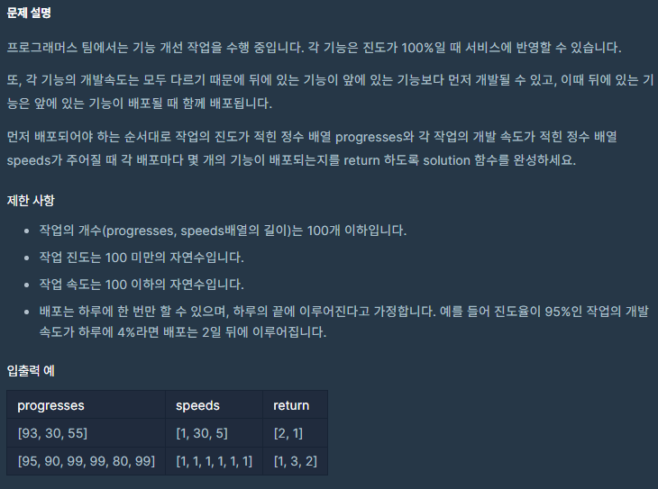
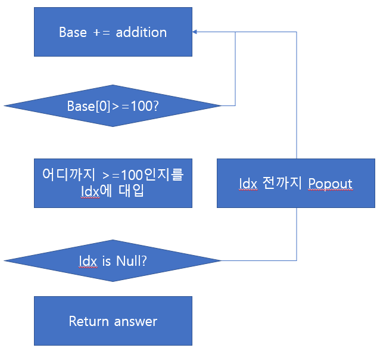

# 코딩테스트 고득점 Kit - 스택/큐 - 기능개발

공부 시점: 2022/02/04
문제 푼 사람: 익명
사이트: programmers
진행 상황: 풀이 중
카테고리: Stack / Queue

# 🔗 문제 링크

[코딩테스트 연습 - 기능개발](https://programmers.co.kr/learn/courses/30/lessons/42586)

# ✏️문제 설명



# 📖문제 풀이



```python
# debug와 동시에 코딩을 진행
# line by line debugging을 시도했었는데 이번 문제는 코딩 후 디버깅을 진행함.
import numpy as np

def solution(progresses, speeds):
    answer = []
    
    base = np.array(progresses)
    addition = np.array(speeds)
    
    # while True:
    for _ in range(10):
				# while 대신 for를 사용하여 무한 루프에 빠지는 것 방지
        base += addition
        print(base)
        print('1')
				# 값을 출력하는 동시에 오류 위치를 찾기 위해 print('1')를 집어 넣음.
				# 실제 코딩 시에는 주석을 위에서부터 풀어가면서 확인함.
        
        if base[0] >= 100:
            idxs, = np.where(base < 100)
            print(idxs)
            print('2')
            if len(idxs) == 0:
                answer.append(len(base))
                print('3')
                return answer
            else:
                idx = idxs[0]
                print(idx)
                print('4')
                answer.append(int(idx))
                print(answer)
                print('5')
                base = base[idx:]
                addition = addition[idx:]
                print(base)
                print('6')
                print(addition)
                print('7')
```

```python
# 제출용 코드
import numpy as np

def solution(progresses, speeds):
    answer = []
    
    base = np.array(progresses)
    addition = np.array(speeds)
    
    while True:
        base += addition        
        if base[0] >= 100:
            idxs, = np.where(base < 100)
            if len(idxs) == 0:
                answer.append(len(base))
                return answer
            else:
                idx = idxs[0]
                answer.append(int(idx))
                base = base[idx:]
                addition = addition[idx:]
```

[numpy.where - NumPy v1.22 Manual](https://numpy.org/doc/stable/reference/generated/numpy.where.html)

# 💡해당 문제 분석

> 다른 사람의 풀이(👍 좋아요 114개)
> 

```python
def solution(progresses, speeds):
    Q=[]
    for p, s in zip(progresses, speeds):
        if len(Q)==0 or Q[-1][0]<-((p-100)//s):
            Q.append([-((p-100)//s),1])
        else:
            Q[-1][1]+=1
    return [q[1] for q in Q]
```

> 다른 사람의 풀이(👍 좋아요 82개)
> 

```python
def solution(progresses, speeds):
    answer = []
    time = 0
    count = 0
    while len(progresses)> 0:
        if (progresses[0] + time*speeds[0]) >= 100:
            progresses.pop(0)
            speeds.pop(0)
            count += 1
        else:
            if count > 0:
                answer.append(count)
                count = 0
            time += 1
    answer.append(count)
    return answer
```