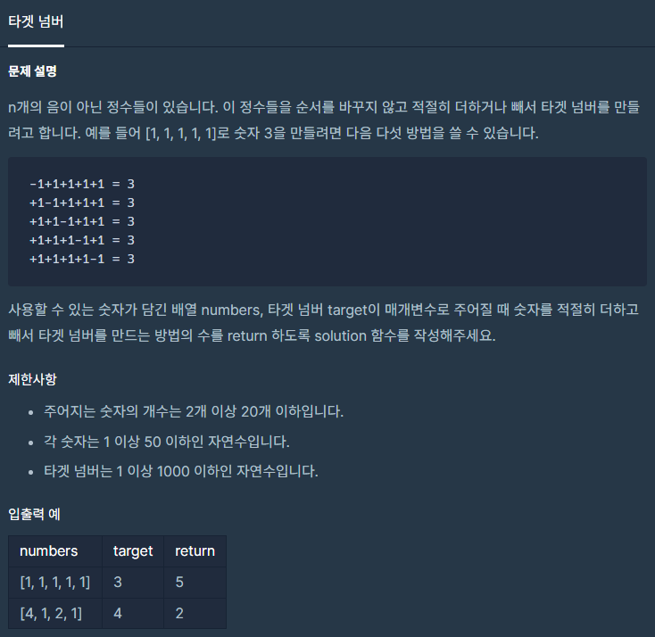

# 코딩테스트 고득점 Kit - 깊이/너비 우선 탐색 -  • 타겟 넘버

공부 시점: 2022/02/15
문제 푼 사람: 익명
비고: 나의 경우엔 재귀함수로 품.
사이트: programmers
진행 상황: 공부 완료
카테고리: DFS/BFS

---

# 🔗 문제 링크

[코딩테스트 연습 - 타겟 넘버](https://programmers.co.kr/learn/courses/30/lessons/43165)

# ✏️문제 설명



# 📖문제 풀이

```python
import numpy as np

def solution(numbers, target):
    # 재귀함수를 위한 초기화
    idx, sign, result = 0, [], [0] * len(numbers)
    # 재귀함수 호출
    recur(idx, sign, result)
    
    # 내적을 위해 형변환
    numbers = np.array(numbers)
    # 각 요소 별로 내적 진행
    # table = [np.dot(i, numbers) for i in sign]
    table = [np.dot(i, numbers) for i in sign]
    # table 중 해당 값이 몇 개 있는지 확인
    return table.count(target)

def recur(idx, sign, result):
    # 채워 넣을 값은 덧셈이냐 뺄셈이냐로 정했다.
    for i in [1, -1]:
        # 해당 요소의 값을 지정
        result[idx] = i
        # 커서 forward
        idx += 1
        
        # sign에 0이 있는지
        if not 0 in result:
            # 없으면 sign에 등록
            sign.append(np.array(result[:]))
        else:
            # 있으면 재귀 함수 호출
            recur(idx, sign, result)
        
        # 커서 backward
        idx -= 1
        # 해당 요소의 값을 초기화
        result[idx] = 0
```

# 💡해당 문제 분석

> 나의 경우엔, ‘깊이/너비 우선 탐색’으로 풀지 않고 재귀 함수로 풀어냈다.

재귀 함수의 끝단은 0이 존재하느냐로 검사했다.
> 

<aside>
🧾 다른 사람의 풀이(👍 좋아요 173)

</aside>

```python
def solution(numbers, target):
    if not numbers and target == 0 :
        return 1
    elif not numbers:
        return 0
    else:
				result  = solution(numbers[1:], target - numbers[0])
				result += solution(numbers[1:], target + numbers[0])
        return result
```

<aside>
🧾 다른 사람의 풀이(👍 좋아요 84)

</aside>

```python
from itertools import product
def solution(numbers, target):
    l = [(x, -x) for x in numbers]
    s = list(map(sum, product(*l)))
    return s.count(target)
```

<aside>
🧾 다른 사람의 풀이(👍 좋아요 33)

</aside>

```python
answer = 0
def DFS(idx, numbers, target, value):
    global answer
    N = len(numbers)
    if(idx== N and target == value):
        answer += 1
        return
    if(idx == N):
        return

    DFS(idx+1,numbers,target,value+numbers[idx])
    DFS(idx+1,numbers,target,value-numbers[idx])
def solution(numbers, target):
    global answer
    DFS(0,numbers,target,0)
    return answer
```