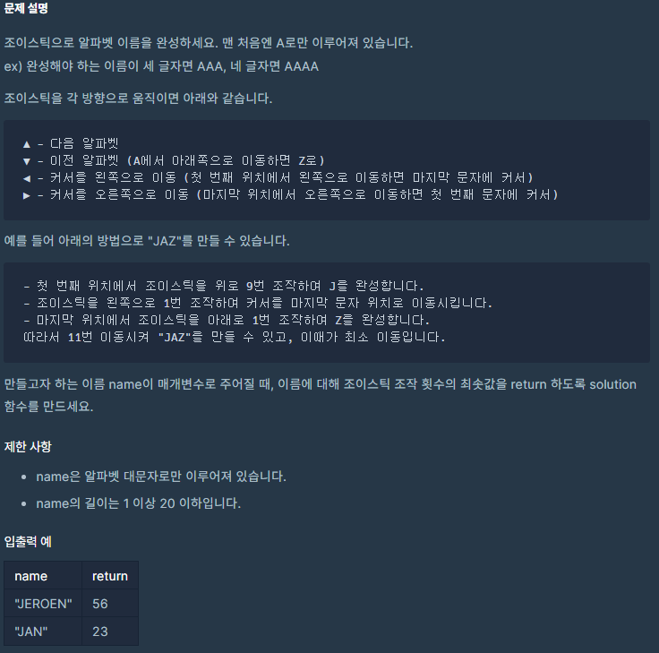

# 코딩테스트 고득점 Kit - 탐욕법 - 조이스틱

공부 시점: 2022/02/11
문제 푼 사람: 익명
사이트: programmers
진행 상황: 공부 완료
카테고리: Greedy

---

# 🔗 문제 링크

[코딩테스트 연습 - 조이스틱](https://programmers.co.kr/learn/courses/30/lessons/42860)

# ✏️문제 설명



# 📖문제 풀이

```python
import re 

def solution(name):
    answer = sum([upDown(i) for i in name])
    answer += leftRight(name)
    return answer

def upDown(char):
		# 위로 레버를 올릴 때의 횟수
    u = ord(char) - ord('A')
		# 위로 레버를 내릴 때의 횟수
    d = ord('Z') - ord(char) + 1
    return min(u, d)

def leftRight(name):
    N = len(name)
    reg = re.compile('A+')
    # 다음은 A가 뭉탱이로 존재할 때, 
    # 그것들을 우회하기 위해 
    # A 뭉탱이 전까지의 경로 길이,
    # A 뭉탱이 이후의 경로 길이
    # 를 구하는 것이다.
    # 추가로 A가 맨 앞에 오면 경로 길이가 음수가 나와 오답이 발생한다.
    # 따라서 아래 3번째 줄과 같이 처리함.
    bundle = [i.span() for i in reg.finditer(name)]
    lengths = [[i[0] - 1, N - i[1]] for i in bundle]
    lengths = [[max(i[0], 0), i[1]] for i in lengths]
    # A를 우회하는 경로로 갔을 때, 경로 길이 후보들이다.
    # 왔다 갔다까지 고려하기 위해 min(i)를 추가로 더함.
		# BBBBAAAAABBBBBB
		# =-->
		# ---=     <-----
    move = [min(i) + sum(i) for i in lengths]
    # A가 존재하지 않을 때, 경로 길이
    move += [N - 1]
    
    return min(move)
		
```

# 💡해당 문제 분석

> 해당 문제는 Greedy 유형의 문제다.

Greedy 풀이법이란 **현재 상황에서 당장 좋은 것만 고르는 방법**을 의미한다.
”이것이 취업을 위한 코딩테스트다.” 저자의 말의 의하면 이 유형은 암기를 요구하는 문제가 아닌 새로운 문제를 만났을때, 아이디어를 떠올리는 창의력을 요구하는 문제라고 한다. 
걍 본인의 능력에 의존한다라는 이야기 같다.
>