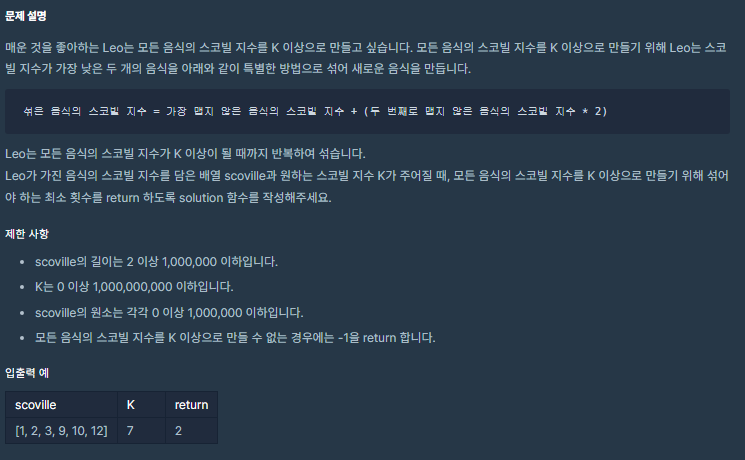
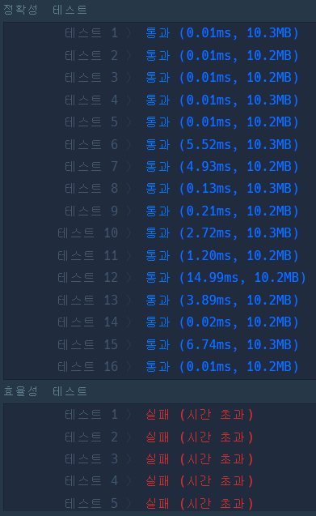

# 코딩테스트 고득점 Kit - Heap - 더 맵게

문제 푼 사람: 익명
비고: heapq에 관한 설명이 내포되어 있다.
사이트: programmers
진행 상황: 풀이 중
카테고리: Heap

# 🔗 문제 링크

[코딩테스트 연습 - 더 맵게](https://programmers.co.kr/learn/courses/30/lessons/42626)

# ✏️문제 설명



# 📖문제 풀이

```python
from collections import deque

def solution(scoville, K):
    answer = 0
    scoville.sort()
    ls_scoville = deque(scoville)
    # print(ls_scoville,"!")
    length = len(ls_scoville)
    # print(length,"@")
    
    while True:
        lower = ls_scoville.popleft()
        upper = ls_scoville.popleft()
        new = lower + upper * 2
        
        answer += 1
        # print(answer, "#")
        my_sort(ls_scoville, new)
        # print(ls_scoville, "$")
        length -= 1
        # print(length,"%")
        
        if ls_scoville[0] >= K:
            return answer
        if length == 1:
            return -1

def my_sort(ls, new):
    for idx, i in enumerate(ls):
        if i >= new:
            return ls.insert(idx, new)
    ls.append(new)
```



> 마찬가지로 정확성 테스트는 통과했으나 효율성 테스트는 통과하지 못했다.
> 

# 💡해당 문제 분석

> 다른 사람의 풀이(👍 좋아요 36개)
> 

```python
import heapq as hq

def solution(scoville, K):

    hq.heapify(scoville)
    answer = 0
    while True:
        first = hq.heappop(scoville)
        if first >= K:
            break
        if len(scoville) == 0:
            return -1
        second = hq.heappop(scoville)
        hq.heappush(scoville, first + second*2)
        answer += 1  

    return answer
```

> `heapq` 모듈은 **이진 트리(binary tree)** 기반의 **최소 힙(min heap)** 자료구조를 제공한다. min heap을 사용하면 원소들이 항상 정렬된 상태로 추가되고 삭제되며, min heap에서 가장 작은값은 언제나 인덱스 0에 위치한다. 내부적으로 min heap 내의 모든 원소(k)는 항상 자식 원소들(2k+1, 2k+2) 보다 크기가 작거나 같도록 원소가 추가되고 삭제된다.
> 

> 기존의 나의 답을 `heapq`를 이용하여 다시 짰을 때, 효율성 테스트에 통과됨을 확인했다.
파이썬은 사용하는 **collection에 따라 성능차이**가 유의미하게 벌어짐을 확인할 수 있었다.
파이썬을 사용하여 코테를 할 때, 
구현을 우선 시하고 성능 개선은 차후에 생각하는 것이 맞는 듯하다.
>